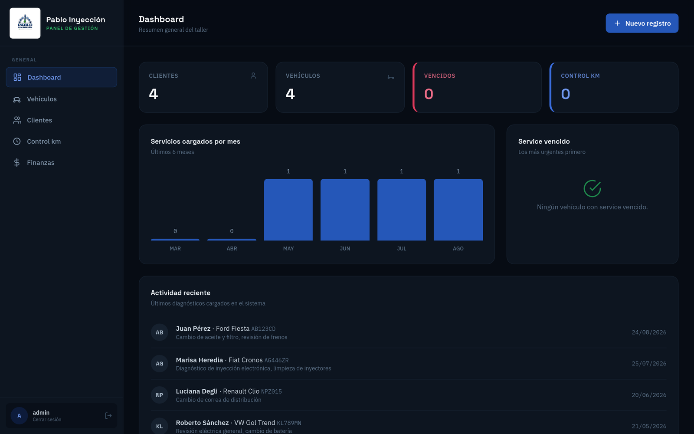
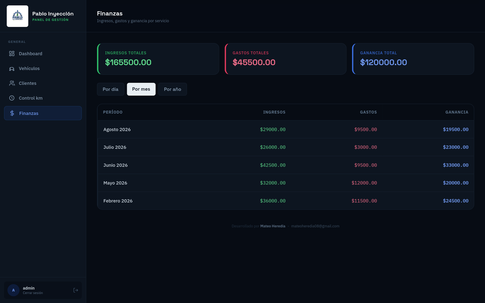
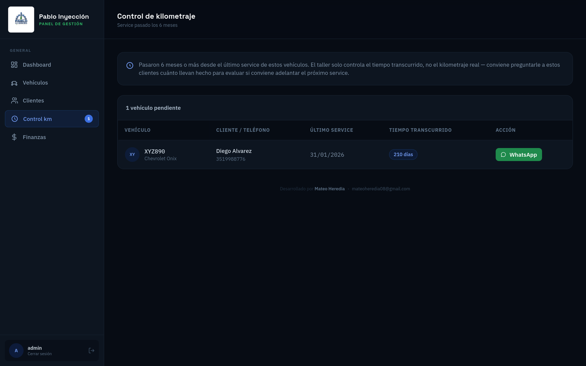
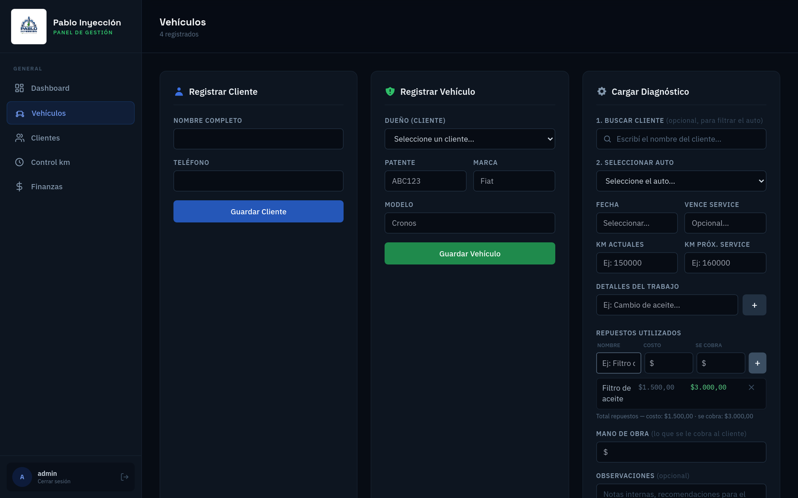
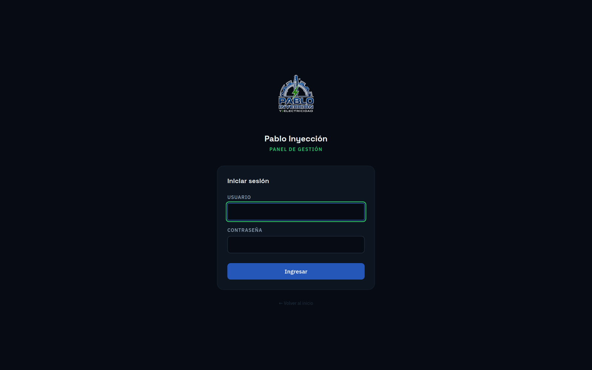
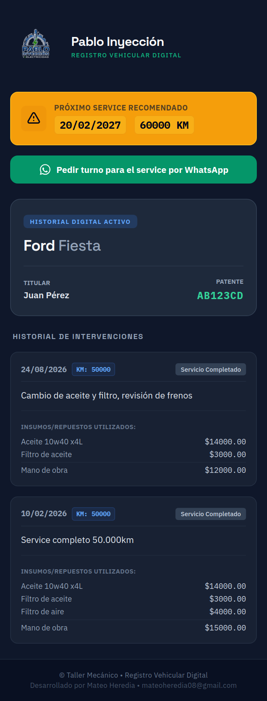

<div align="center">


# Pablo Inyección — Sistema de Gestión de Taller

Panel de administración para un taller mecánico especializado en inyección electrónica
y electricidad automotriz: gestión de clientes y vehículos, historial digital con QR,
control de rentabilidad por servicio y recordatorios automáticos de mantenimiento.

[](https://www.python.org/)
[](https://fastapi.tiangolo.com/)
[](https://www.sqlalchemy.org/)
[](https://supabase.com/)
[](https://tailwindcss.com/)
[](https://render.com/)

</div>

<br>



## Qué resuelve

Un taller mecánico maneja todo su historial de servicios en papel, WhatsApp o
planillas sueltas. Este sistema centraliza esa información: cada vehículo tiene su
propio historial digital accesible por QR, cada service queda registrado con su
costo real y lo cobrado, y el dueño del taller puede ver de un vistazo cuánto está
ganando por mes, quién tiene el service vencido, y a quién le conviene recordarle
que controle el kilometraje.

## Features

- 📊 **Dashboard** con resumen general, gráfico de servicios por mes y alertas de vencimientos
- 🚗 **Gestión de clientes y vehículos**, con historial completo por unidad
- 🔍 **Historial digital por QR**: cada vehículo tiene un link público (sin login) para
  que el cliente consulte sus services desde el celular, con botón directo a WhatsApp
- 💰 **Control financiero por servicio**: cada repuesto se carga con su costo real y el
  precio cobrado al cliente; el sistema calcula ganancia automáticamente y arma un
  resumen de ingresos/gastos por día, mes o año
- ⏰ **Recordatorio de control de kilometraje**: como el taller controla el tiempo pero
  no los km reales que hace cada auto, el sistema avisa a los 6 meses de cada service
  para que se pueda preguntar al cliente y evaluar si conviene adelantar el próximo
- 🔐 **Login con sesión real**, contraseña hasheada con bcrypt, protección básica
  contra fuerza bruta
- 🖨️ **Reportes imprimibles** por servicio, con QR de acceso al historial completo
- 📱 Responsive, con sidebar colapsable en mobile

<br>

<table>
<tr>
<td width="50%">

<p align="center"><sub>Resumen financiero por período</sub></p>
</td>
<td width="50%">

<p align="center"><sub>Alertas de control de kilometraje</sub></p>
</td>
</tr>
<tr>
<td width="50%">

<p align="center"><sub>Carga de diagnósticos con repuestos</sub></p>
</td>
<td width="50%">

<p align="center"><sub>Login propio, con sesión</sub></p>
</td>
</tr>
</table>

<div align="center">

<p><sub>Vista pública del historial (accesible por QR, sin necesidad de login)</sub></p>
</div>

## Stack técnico

**Backend** — FastAPI + SQLAlchemy sobre PostgreSQL (Supabase en producción, SQLite en
desarrollo local sin configuración extra). Autenticación por sesión con cookie firmada
(`itsdangerous`) y contraseña hasheada con `bcrypt`.

**Frontend** — Server-rendered con Jinja2. CSS y tipografías (Space Grotesk, IBM Plex
Sans/Mono) compilados y **self-hosted**: no depende de ningún CDN externo en producción,
lo que lo hace más rápido y más confiable que servir Tailwind desde su Play CDN.

**Deploy** — Docker sobre Render. El CSS se compila una vez con un script (`build_css.sh`)
y se commitea como asset estático, así que el pipeline de deploy no necesita ningún paso
de build de Node — el `Dockerfile` sigue siendo Python puro.

## Estado del Proyecto

**Estado:** En Producción 🟢

El sistema se encuentra desplegado y es utilizado diariamente por el taller para la 
gestión de su flujo de trabajo. 

Al ser un software activo y a medida, este repositorio funciona únicamente como **portafolio arquitectónico**. 
El código fuente y la base de datos se mantienen en privado por seguridad de la infraestructura. 
Si estás evaluando mi perfil, contactame y hacemos un recorrido técnico por el backend.

## Estructura del proyecto

```
app/
├── main.py              # Rutas, lógica de negocio, auth
├── models.py             # Modelos SQLAlchemy
├── utils.py               # Cálculos (próximo service, links de WhatsApp, etc.)
├── templates/
│   ├── base_admin.html    # Shell del panel (sidebar + topbar)
│   ├── dashboard.html
│   ├── finanzas.html
│   └── ...
└── static/
    ├── css/app.css         # Tailwind compilado (self-hosted)
    └── fonts/              # Tipografías propias
build_tools/                # Config de Tailwind para recompilar el CSS
```

---

<div align="center">
<sub>Desarrollado por <b>Mateo Heredia</b> · <a href="mailto:mateoheredia08@gmail.com">mateoheredia08@gmail.com</a></sub>
</div>
